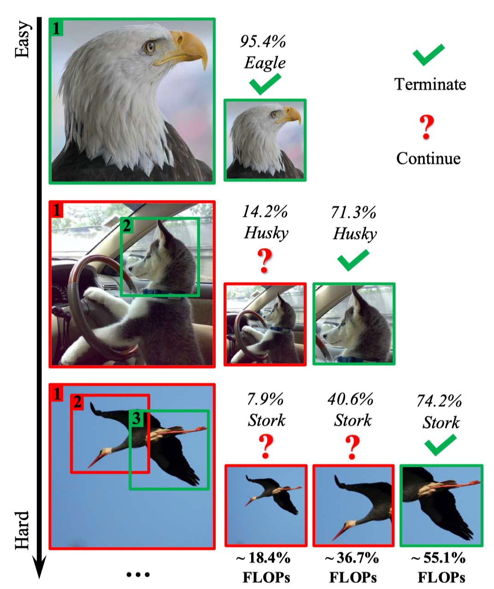
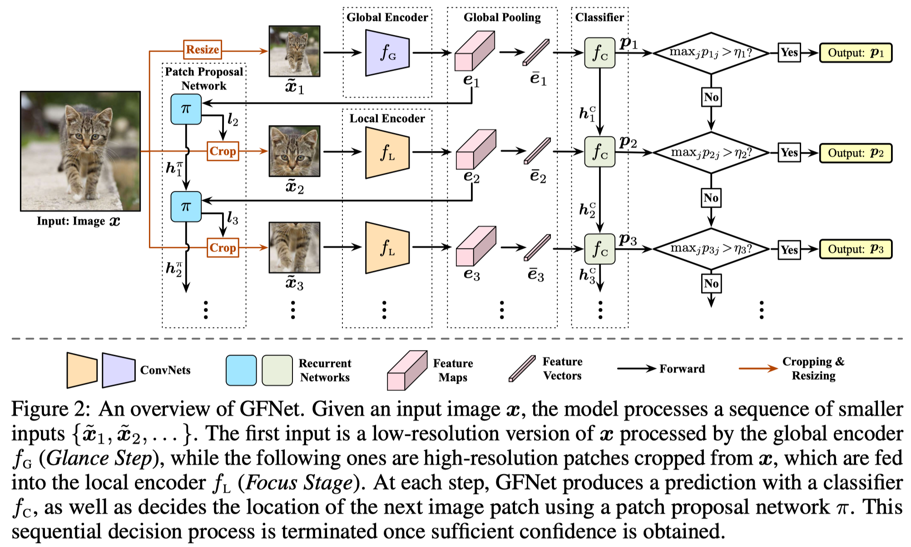
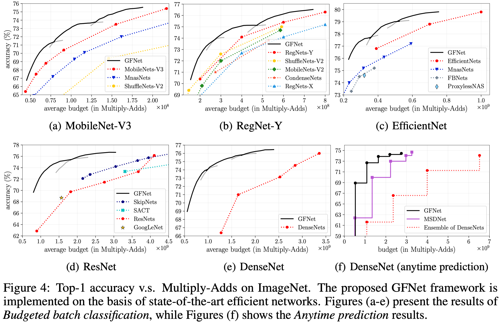
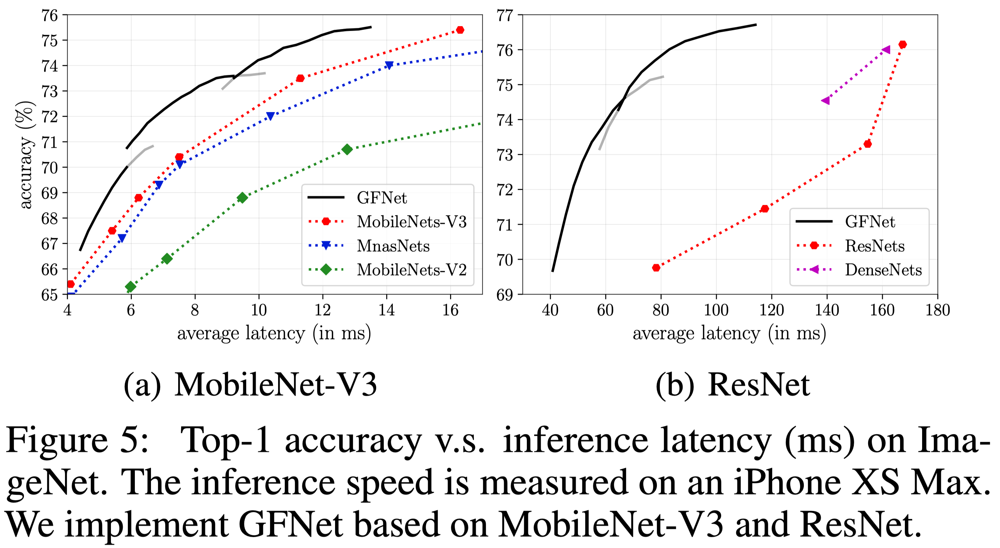
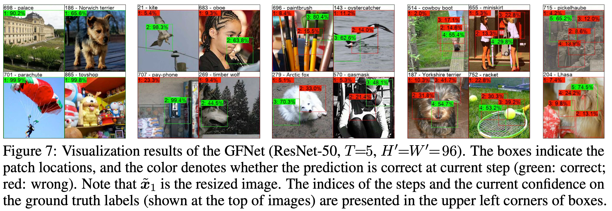

# GFNet-Pytorch (NeurIPS 2020)

This repo contains the official code and pre-trained models for the glance and focus network (GFNet).

- [Glance and Focus: a Dynamic Approach to Reducing Spatial Redundancy in Image Classification](https://arxiv.org/abs/2010.05300)

Citation

```
@inproceedings{NeurIPS2020_7866,
        title = {Glance and Focus: a Dynamic Approach to Reducing Spatial Redundancy in Image Classification},
       author = {Wang, Yulin and Lv, Kangchen and Huang, Rui and Song, Shiji and Yang, Le and Huang, Gao},
    booktitle = {Advances in Neural Information Processing Systems (NeurIPS)},
         year = {2020},
}
```

**Update on 2020/10/08: Release Pre-trained Models and the Inference Code on ImageNet.**

**Update on 2020/12/28: Release Training Code.**

## Introduction

<p align="center">
    
</p>

Inspired by the fact that not all regions in an image are task-relevant, we propose a novel framework that performs efficient image classification by processing a sequence of relatively small inputs, which are strategically cropped from the original image.
Experiments on ImageNet show that our method consistently improves the computational efficiency of a wide variety of deep models.
For example, it further reduces the average latency of the highly efficient MobileNet-V3 on an iPhone XS Max by 20% without sacrificing accuracy.
<p align="center">
    
</p>

## Results

- Top-1 accuracy on ImageNet v.s. Multiply-Adds
<p align="center">
    
</p>

- Top-1 accuracy on ImageNet v.s. Inference Latency (ms) on an iPhone XS Max
<p align="center">
    
</p>


- Visualization
<p align="center">
    
</p>


## Pre-trained Models


|Backbone CNNs|Patch Size|T|Links|
|-----|------|-----|-----|
|ResNet-50| 96x96| 5|[Tsinghua Cloud](https://cloud.tsinghua.edu.cn/f/4c55dd9472b4416cbdc9/?dl=1) / [Google Drive](https://drive.google.com/file/d/1Iun8o4o7cQL-7vSwKyNfefOgwb9-o9kD/view?usp=sharing)|
|ResNet-50| 128x128| 5|[Tsinghua Cloud](https://cloud.tsinghua.edu.cn/f/1cbed71346e54a129771/?dl=1) / [Google Drive](https://drive.google.com/file/d/1cEj0dXO7BfzQNd5fcYZOQekoAe3_DPia/view?usp=sharing)|
|DenseNet-121| 96x96| 5|[Tsinghua Cloud](https://cloud.tsinghua.edu.cn/f/c75c77d2f2054872ac20/?dl=1) / [Google Drive](https://drive.google.com/file/d/1UflIM29Npas0rTQSxPqwAT6zHbFkQq6R/view?usp=sharing)|
|DenseNet-169| 96x96| 5|[Tsinghua Cloud](https://cloud.tsinghua.edu.cn/f/83fef24e667b4dccace1/?dl=1) / [Google Drive](https://drive.google.com/file/d/1pBo22i6VsWJWtw2xJw1_bTSMO3HgJNDL/view?usp=sharing)|
|DenseNet-201| 96x96| 5|[Tsinghua Cloud](https://cloud.tsinghua.edu.cn/f/85a57b82e592470892e0/?dl=1) / [Google Drive](https://drive.google.com/file/d/1sETDr7dP5Q525fRMTIl2jlt9Eg2qh2dx/view?usp=sharing)|
|RegNet-Y-600MF| 96x96| 5|[Tsinghua Cloud](https://cloud.tsinghua.edu.cn/f/2638f038d3b1465da59e/?dl=1) / [Google Drive](https://drive.google.com/file/d/1FCR14wUiNrIXb81cU1pDPcy4bPSRXrqe/view?usp=sharing)|
|RegNet-Y-800MF| 96x96| 5|[Tsinghua Cloud](https://cloud.tsinghua.edu.cn/f/686e411e72894b789dde/?dl=1) / [Google Drive](https://drive.google.com/file/d/1On39MwbJY5Zagz7gNtKBFwMWhhHskfZq/view?usp=sharing)|
|RegNet-Y-1.6GF| 96x96| 5|[Tsinghua Cloud](https://cloud.tsinghua.edu.cn/f/90116ad21ee74843b0ef/?dl=1) / [Google Drive](https://drive.google.com/file/d/1rMe0LU8m4BF3udII71JT0VLPBE2G-eCJ/view?usp=sharing)|
|MobileNet-V3-Large (1.00)| 96x96| 3|[Tsinghua Cloud](https://cloud.tsinghua.edu.cn/f/4a4e8486b83b4dbeb06c/?dl=1) / [Google Drive](https://drive.google.com/file/d/1Dw16jPlw2hR8EaWbd_1Ujd6Df9n1gHgj/view?usp=sharing)|
|MobileNet-V3-Large (1.00)| 128x128| 3|[Tsinghua Cloud](https://cloud.tsinghua.edu.cn/f/ab0f6fc3997d4771a4c9/?dl=1) / [Google Drive](https://drive.google.com/file/d/1Ud_olyer-YgAb667YUKs38C2O1Yb6Nom/view?usp=sharing)|
|MobileNet-V3-Large (1.25)| 128x128| 3|[Tsinghua Cloud](https://cloud.tsinghua.edu.cn/f/b2052c3af7734f688bc7/?dl=1) / [Google Drive](https://drive.google.com/file/d/14zj1Ci0i4nYceu-f2ZckFMjRmYDGtJpl/view?usp=sharing)|
|EfficientNet-B2| 128x128| 4|[Tsinghua Cloud](https://cloud.tsinghua.edu.cn/f/1a490deecd34470580da/?dl=1) / [Google Drive](https://drive.google.com/file/d/1LBBPrrYZzKKqCnoZH1kPfQQZ5ixkEmjz/view?usp=sharing)|
|EfficientNet-B3| 128x128| 4|[Tsinghua Cloud](https://cloud.tsinghua.edu.cn/f/d5182a2257bb481ea622/?dl=1) / [Google Drive](https://drive.google.com/file/d/1fdxwimcuQAXBOsbOdGw8Ee43PgeHHZTA/view?usp=sharing)|
|EfficientNet-B3| 144x144| 4|[Tsinghua Cloud](https://cloud.tsinghua.edu.cn/f/f96abfb6de13430aa663/?dl=1) / [Google Drive](https://drive.google.com/file/d/1OVTGI6d2nsN5Hz5T_qLnYeUIBL5oMeeU/view?usp=sharing)|

- What are contained in the checkpoints:

```
**.pth.tar
├── model_name: name of the backbone CNNs (e.g., resnet50, densenet121)
├── patch_size: size of image patches (i.e., H' or W' in the paper)
├── model_prime_state_dict, model_state_dict, fc, policy: state dictionaries of the four components of GFNets
├── model_flops, policy_flops, fc_flops: Multiply-Adds of inferring the encoder, patch proposal network and classifier for once
├── flops: a list containing the Multiply-Adds corresponding to each length of the input sequence during inference
├── anytime_classification: results of anytime prediction (in Top-1 accuracy)
├── dynamic_threshold: the confidence thresholds used in budgeted batch classification
├── budgeted_batch_classification: results of budgeted batch classification (a two-item list, [0] and [1] correspond to the two coordinates of a curve)

```

## Requirements
- python 3.7.7
- torch 1.3.1
- torchvision 0.4.2
- pyyaml 5.3.1 (for RegNets)

## Evaluate Pre-trained Models

Read the evaluation results saved in pre-trained models
```
CUDA_VISIBLE_DEVICES=0 python inference.py --checkpoint_path PATH_TO_CHECKPOINTS  --eval_mode 0
```

Read the confidence thresholds saved in pre-trained models and infer the model on the validation set
```
CUDA_VISIBLE_DEVICES=0 python inference.py --data_url PATH_TO_DATASET --checkpoint_path PATH_TO_CHECKPOINTS  --eval_mode 1
```

Determine confidence thresholds on the training set and infer the model on the validation set
```
CUDA_VISIBLE_DEVICES=0 python inference.py --data_url PATH_TO_DATASET --checkpoint_path PATH_TO_CHECKPOINTS  --eval_mode 2
```

The dataset is expected to be prepared as follows:
```
ImageNet
├── train
│   ├── folder 1 (class 1)
│   ├── folder 2 (class 1)
│   ├── ...
├── val
│   ├── folder 1 (class 1)
│   ├── folder 2 (class 1)
│   ├── ...

```


## Training

- Here we take training ResNet-50 (96x96, T=5) for example. All the used initialization models and stage-1/2 checkpoints can be found in [Tsinghua Cloud](https://cloud.tsinghua.edu.cn/d/ac7c47b3f9b04e098862/) / [Google Drive](https://drive.google.com/drive/folders/1yO2GviOnukSUgcTkptNLBBttSJQZk9yn?usp=sharing). Currently, this link includes ResNet and MobileNet-V3. We will update it as soon as possible. If you need other helps, feel free to contact us.

- The Results in the paper is based on 2 Tesla V100 GPUs. For most of experiments, up to 4 Titan Xp GPUs may be enough.

Training stage 1, the initializations of global encoder (model_prime) and local encoder (model) are required:
```
CUDA_VISIBLE_DEVICES=0,1,2,3 python train.py --data_url PATH_TO_DATASET --train_stage 1 --model_arch resnet50 --patch_size 96 --T 5 --print_freq 10 --model_prime_path PATH_TO_CHECKPOINTS  --model_path PATH_TO_CHECKPOINTS
```

Training stage 2, a stage-1 checkpoint is required:
```
CUDA_VISIBLE_DEVICES=0 python train.py --data_url PATH_TO_DATASET --train_stage 2 --model_arch resnet50 --patch_size 96 --T 5 --print_freq 10 --checkpoint_path PATH_TO_CHECKPOINTS
```

Training stage 3, a stage-2 checkpoint is required:
```
CUDA_VISIBLE_DEVICES=0,1,2,3 python train.py --data_url PATH_TO_DATASET --train_stage 3 --model_arch resnet50 --patch_size 96 --T 5 --print_freq 10 --checkpoint_path PATH_TO_CHECKPOINTS
```

## Contact
If you have any question, please feel free to contact the authors. Yulin Wang: wang-yl19@mails.tsinghua.edu.cn.

## Acknowledgment
Our code of MobileNet-V3 and EfficientNet is from [here](https://github.com/rwightman/pytorch-image-models). Our code of RegNet is from [here](https://github.com/facebookresearch/pycls).

## To Do
- Update the code for visualizing.

- Update the code for MIXED PRECISION TRAINING。

